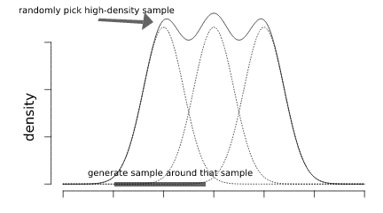
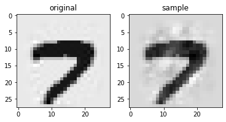
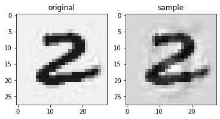
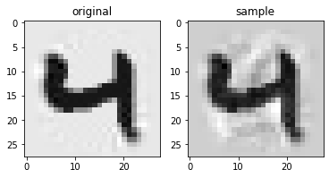
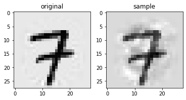
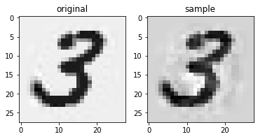
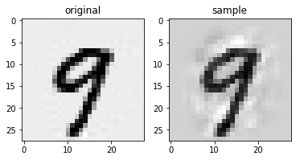

# Generating hand-written digits using Kernel Density Estimator

### Kernel Density Estimation
Kernel Density Estimation is a non-parametric method for estimating the probability of a given point, using a dataset.

#### Univariate Gaussian kernel

Given a point $x$, its probability respected to a dataset $x_1,x_2,x_3,x_4..,x_n$ is:
$$
\hat{f_h}(x)= \frac{1}{nh}\sum_{i=1}^NK  \left( \frac{x-x_i}{h} \right)
$$
where $K$ is a kernel function.

A kernel function is **typically**:
- non-negative: $K(x) > 0, \forall x$
- symmetric: $K(x) = K(-x), \forall x$
- decreasing: $K'(x) \leq 0, \forall x>0$

There are variety of kernels: Gaussian, Triangle, Uniform, etc. However, the choice of kernel is not that important no matter what kernel you choose. As you get more and more data, the estimations will end up being very similar [1].In contrast the choice of bandwidth is very crucial. If larger $h$ is, the more it spreads the kernel. 

#### "Extended" Univariate Gaussian kernel
A simple way to extend univariate gaussian kernel to work with higher dimension is to introduce $p-norm$ to calculate distance (Let's call this **"Extended" Univariate Gaussian kernel**):

$$
\hat{f_h}(x)=\frac{1}{nh} \sum_{i=1}^NK \left( \frac{||x-x_i||_p}{h} \right) 
$$


The choice of $p$ can be varied for different problems. Usually, the norm of $p=1$,$p=2$ or $p=+\infty$ are common. A good start would be L2 distance, which is invariant to rotation. 

#### Multivariate Gaussian kernel
The problem of p-norm Gaussian kernel is, without a doubt: the bandwidth $p$ value should be treated seperately for each feature of the vector since they're coming from different distribution and have different scales. Thus, the kernel density estimate [2] can be defined to be:
$$
\hat{f_H}(x)=\frac{1}{n} \sum_{i=1}^N K_H(x-x_i)
$$
- H is the $d\times d$ bandwidth matrix which is symmetric and positive definite
- since the choice of kernel is not important, we use the well-known multivariate normal kernel:  
$$K_H(x) =  (2\pi)^{-d/2}|H|^{-1/2}e^{\frac{-1}{2}x^T H^{-1} x}$$


### Estimating bandwidth H for KDE for with Multivariate Gaussian Kernel
2 simple way to estimate $H$ is to use Silverman's rule and Scott rule.
These 2 method are assumming the data to come from mixture of gaussian distribution. 

#### Silverman's rule of thumbs
[3] Silverman's rule of thumbs suggest using $\sqrt{H_{ii}}=(\frac{4}{d+2})^\frac{1}{d+4}n^{\frac{-1}{d+4}}\sigma_i$ where $\sigma_i$ is the standard deviation of the i-th variable and $H_{ij}=0, \forall i\neq j$

#### Scotts' rule
[3] Scott's rule is $\sqrt{H_{ii}} = n^{\frac{-1}{d+4}}\sigma_i$ where $\sigma_i$ is the standard deviation of the i-th variable and $H_{ij}=0, \forall i\neq j$

The problem arises when the assumptions aren't met. There are other bandwidth estimating method but I don't have enough to go through them all

### Sampling method
1. Estimate bandwidth matrix $H$ using Silverman's rule or Scott's rule
2. Random pick a high density sample from a chosen class $x_r$
3. Draw a random variable from multivariate normal distribution $ \mathcal{N}(\mu=x_r,\Sigma=H*k) $

Where k is the scaling factor, the larger k is, the more  different the image from the source image $x_r$ is. This method strong assumes that the data comes from a mixture of gaussians and each gaussian has equal covariance. Emperically I choose $k=1e-2$ for Silverman's bandwidth and $k=1e-1$ for the best result.



#### Some examples of generated MNIST















  
    


## Engineering process
### Vectorization and broadcasting
Given a set of input "X" and a set of resource "data" to calculate density based upon that. There are 2 possible way that you can implement:

**1 loop style (2D broadcasting)**

```
probs ← {}
for each x in X
   distance ← x-data # shape (n_data,dim)
   prob ← sum(1/n*multivariate_kernel(distance))
   probs.append(prob)
```
**no loop style (3D broadcasting)**
```
 transform X to shape  (1,dim,n_X)
 transform data to shape  (n_data,dim,1)
 dist ← X - data # shape (n_data,dim,n_X)
 transform dist to shape (n_data*n_X,dim) #equivalent to stack every layer in third dimension stack below each other.
 probs ← 1/n*multivariate_kernel(khoảng cách) # shape (n_data*n_X,1)
 transform probs to shape (n_data,n_X)
 probs ← prob.sum(axis=1)
```
### Predicting on small batches
Because of 3D broadcasting, the estimation runs very fast, however, very ram-dependent. We can eleviate the problem by splitting the input data to small batches to predict one by one.

## Implementation
You can access to the experimental notebook at [this link](https://drive.google.com/file/d/1znM3U2-_hXisowmLXrcouida5BYdnVBF/view?usp=sharing).
Please kindly include `KDE.py` to the notebook to run properly

## References

[1] [webel od - Intro to Kernel Density Estimation](https://www.youtube.com/watch?v=x5zLaWT5KPs)<br>
[2] [Wiki - Kernel density estimation](https://en.wikipedia.org/wiki/Kernel_density_estimation)<br>
[3] [Wiki - Multivariate kernel density estimation](https://en.wikipedia.org/wiki/Multivariate_kernel_density_estimation)<br>
[4] [Nicolas Langrené∗, Xavier Warin - Fast and stable multivariate kernel densityestimation by fast sum updating](https://arxiv.org/pdf/1712.00993.pdf)
