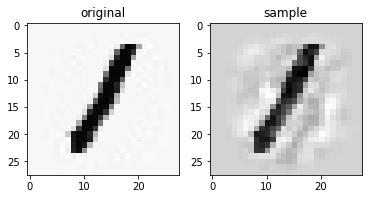

# Generate-Handwritten-Digits-Kernel-Density-Estimation

Kernel Density Estimation (KDE) is a non-parametric method for estimating the probability of a given point, using a dataset. This is an implementation of using numpy, with the goal of sampling new images from MNIST dataset.





## Usage:

### Extended Univariate Gaussian Kernel
We introduce norm to leverage univariate kernel to work with high dimension (read the Report.md)

```python
# Choice of bandwidth
bandwidth = 2000

# Create KDE obj and fit the data
Estimator = KDE(kernel="univariate_gaussian",univariate_bandwidth=bandwidth)
Estimator.fit(x_train)

# Estimating bandwidth
est_density = Estimator.predict(x_test,batch_size=100)

```

### Multivariate Gaussian Kernel
Also, we can use multivariate gaussian kernel to estimate density at one point in high dimension

```python
# Bandwidth estimator choice
bandwidth_estimator="silverman"

# Use multivariate kernel, and scott rule to estimate bandwidth H
Estimator = KDE(kernel="multivariate_gaussian", bandwidth_estimator=bandwidth_estimator)
Estimator.fit(x_train,y_train)

# Estimating bandwidth
est_density = Estimator.predict(x_test,batch_size=100)
```

**Note:**
- The bigger `batch_size`, the faster the operation goes but more ram-dependent
- If run out ram, please kindly decrease `batch_size`

### Drawing new sample using KDE


```python
# Use multivariate kernel, and scott's rule or silverman's rule to estimate bandwidth H
Estimator = KDE(kernel="multivariate_gaussian", bandwidth_estimator="scott")
Estimator.fit(x_train_pca_scaled[:num_train],y_train[:num_train])

# Scaling factor 
k = 1e-1

# Generate sample images
original,sample = Estimator.random_sample(scaling_factor=k)
```
Where k is the scaling factor, the larger k is, the more  different the image from the source image `x_r` is. This method strong assumes that the data comes from a mixture of gaussians and each gaussian has equal covariance. Emperically I choose `k=1e-2` for Silverman's bandwidth and `k=1e-1` for the best result.**

**Note**
the bigger the `scaling_factor`, the more the generated images fluctuate


## Implementation
You can access to the experimental notebook at [this link](https://drive.google.com/file/d/1znM3U2-_hXisowmLXrcouida5BYdnVBF/view?usp=sharing).
Please kindly include `KDE.py` to the notebook to run properly


## References
[1] [webel od - Intro to Kernel Density Estimation](https://www.youtube.com/watch?v=x5zLaWT5KPs)<br>
[2] [Wiki - Kernel density estimation](https://en.wikipedia.org/wiki/Kernel_density_estimation)<br>
[3] [Wiki - Multivariate kernel density estimation](https://en.wikipedia.org/wiki/Multivariate_kernel_density_estimation)<br>
[4] [Nicolas Langrené∗, Xavier Warin - Fast and stable multivariate kernel densityestimation by fast sum updating](https://arxiv.org/pdf/1712.00993.pdf)

